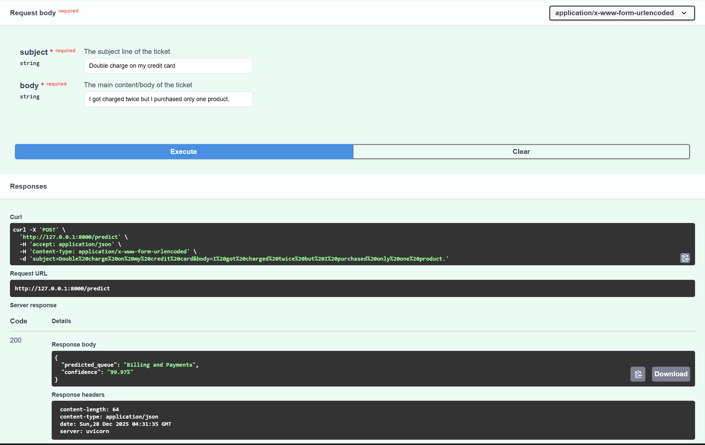

# Support Ticket Auto-Triage 

An classification pipeline designed to automate the routing of customer support tickets. This project compares traditional Machine Learning baselines (SVM, SGD) against a Deep Learning approach (DistilBERT) to categorize tickets into 10 distinct support queues.

## Dataset
```bash
https://huggingface.co/datasets/Tobi-Bueck/customer-support-tickets
```

## Features

* **Multi-Model Architecture:**
    * **Baseline:** TF-IDF Vectorization with Linear SVM and SGD Classifiers.
    * **Deep Learning:** Fine-tuned **DistilBERT** (Hugging Face Transformers) using **Class Weighting** to effectively handle imbalanced data.
* **Production-Ready API:** A **FastAPI** service designed to serve predictions in real-time.
* **Dockerized Deployment:** Fully containerized application using `uv` for dependency management and Python 3.12.
* **GPU Acceleration:** Optimized for training on NVIDIA GPUs, specifically configured for RTX 50-series (Blackwell) hardware via PyTorch Nightly.

## Model Performance

Evaluated on a dataset of ~28k English support tickets. The **Weighted DistilBERT** model achieved the highest performance by successfully identifying rare categories that simpler models often ignore.

| Model | Accuracy | Macro F1-Score | Key Strength |
| :--- | :--- | :--- | :--- |
| **Linear SVM** | 52% | 0.53 | Fast training baseline. |
| **SGD Classifier** | 67% | 0.68 | Strong performance with N-grams. |
| **DistilBERT (Weighted)** | **70%** | **0.74** | **Superior on rare classes (e.g., General Inquiry F1: 0.79)**. |

*Note: Class weights were critical for the transformer model to improve General Inquiry F1-scores from 0.05 to 0.79.*

## Tech Stack

* **Language:** Python 3.12
* **Deep Learning:** PyTorch (Nightly), Transformers (Hugging Face)
* **Machine Learning:** Scikit-learn, Pandas, NumPy
* **API:** FastAPI, Uvicorn
* **DevOps:** Docker, uv (Package Manager)

## Installation

This project uses **uv** for fast, reproducible dependency management.

### 1. Clone the Repository
```bash
git clone https://github.com/James-Crockett/Support_Ticket_Auto_Triage.git
cd Support_Ticket_Auto_Triage
```

### 2. Install Dependencies
```bash
# Install uv if you haven't already
pip install uv

# Sync dependencies (creates .venv automatically)
uv sync
```
### 3. GPU Setup (Optional)

The project is configured to use PyTorch Nightly (CUDA 12.8) for compatibility with RTX 50-series (sm_120) hardware. Maybe in future this would be unnecessary.

### 4. Usage

### Training
The training logic is split into Jupyter Notebooks:

**1. notebooks/data_exp_linear.ipynb:** EDA and Linear baseline models.

**2. notebooks/transformer.ipynb:** Deep Learning DistilBERT finetuned.

### Docker Deployment
Build and run the inference API:

```bash
docker build -t ticket-triage-api .
docker run -p 8000:8000 ticket-triage-api
```
### API Usage

```bash
curl -X 'POST' \
  'http://localhost:8000/predict' \
  -d 'subject=Login Issue&body=I cannot access my account.'
  ```

### Response:

<!-- ### Sample -->


<!-- ```JSON
{
  "predicted_queue": "Technical Support"
}
``` -->

## Project Structure

```bash
├── models/                  # Saved models (Git-ignored)
│   ├── sgd/                 # Serialized SGD model & vectorizer
│   └── transformer/         # Fine-tuned DistilBERT model
├── notebooks/               # Jupyter Notebooks for training
├── main.py                  # FastAPI application entry point
├── Dockerfile               # Production Docker config
├── pyproject.toml           # Dependency configuration
└── README.md                # Project documentation
```


